# Django-сайт для зуботехнической лаборатории.
## Исходники к сайту  зуботехнической лаборатории [Дент-Альянс](https://noris95.pythonanywhere.com/price/)
С помощью этого сайта суперпользователь может добавлять в прайс-лист фото протеза, цену и название протеза. Во вкладке "информация" суперпользователь может сам написать информацию о своей зуботехнической лаборатории, а обычный пользователь может ознакомиться с прайс-листом, адресом и другой информацией, принадлежащей зуботехнической лаборатории.
### Инструкция по хостингу этого сайта на ресурсе PythonAnywhere: ###
  1.Заходим во вкладку __Consoles__ и после этого в разделе _Other:_ нажимаем на кнопку `Bash`, с помощью чего попадаем в терминал :
  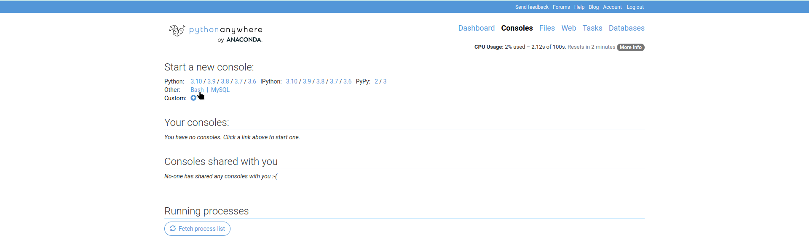
  2.Склонируем репозиторий нашего сайта и зайдём в в репозиторий:
  ```
  git clone https://github.com/NoRIS95/DT_Lab-Dental-Alliance-on-Django.git
  cd DT_Lab-Dental-Alliance-on-Django 
  ```
  3. Узнаем версию Python:
  ```
  python
  ```
  4. Создаём виртуальное окружение, указав нужную версию Python. В нашем случае это версия 3.10.
  ```
  python3.10 -m venv env
  . ./env/bin/activate
  mkdir static media
  cd taskmanager
  pip install -r requirements.txt
  ```
  5. На время переходим из терминала на сайт PythonAnywhere во вкладке __Web__ создаём новое веб-приложение.__При  создании приложения обязательно режим ручной настройки нужно указать именно ту версию Python, которая была указана в терминале (п.3)!__
  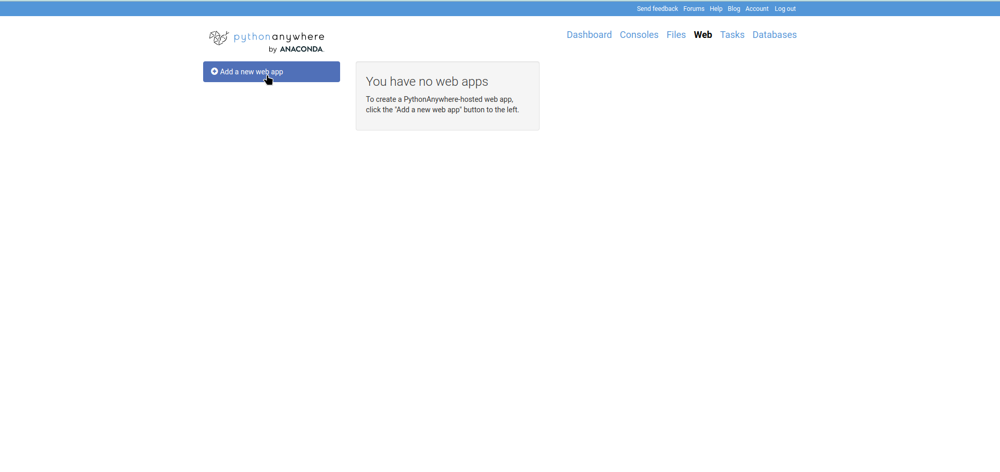
  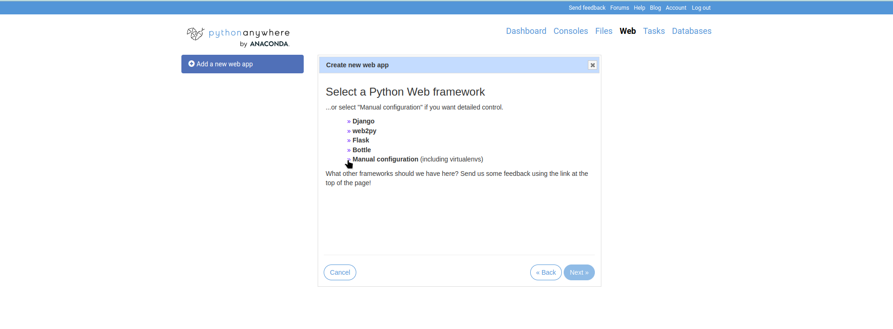
  
  7. В поле _Source code_ раздела _Code_ указываем путь директории, в которой находится файл `manage.py`
  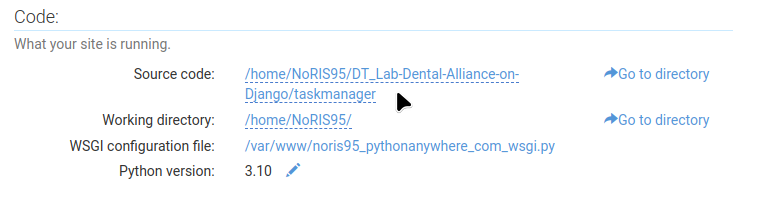
  9. В поле раздела _Virtualenv_ указываем путь к виртуальному окружению.
  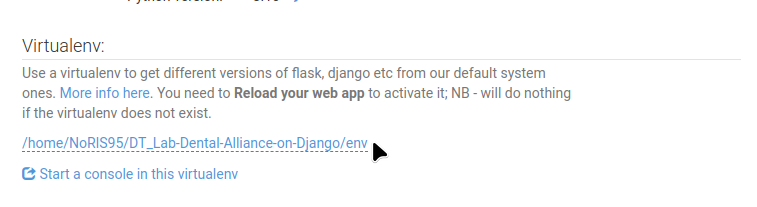
  11. В разделе _Static files_ указываем названия директорий, в которых будут находится статические файлы, и пути к этим директориям.
  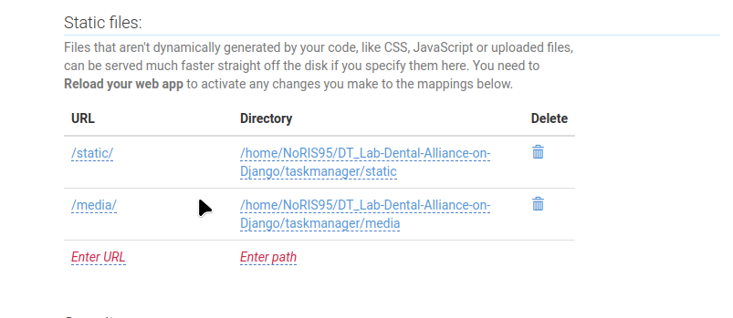
  12. В файле _WSGI configuration file_ раздела _Code_ делаем некоторые изменения. Нужно закоментировать 19-47 строчки; раскоментировать 76, 77, 81-83, 85, 88 и 89 строчки. В 81 строчке указываем путь к директории с файлом `manage.py`, в 85 строчке указываем название директории, в которой находится файл `settings.py` (в нашем случае это директория proj).
  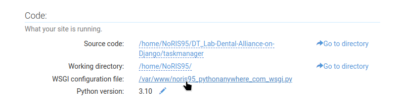 
  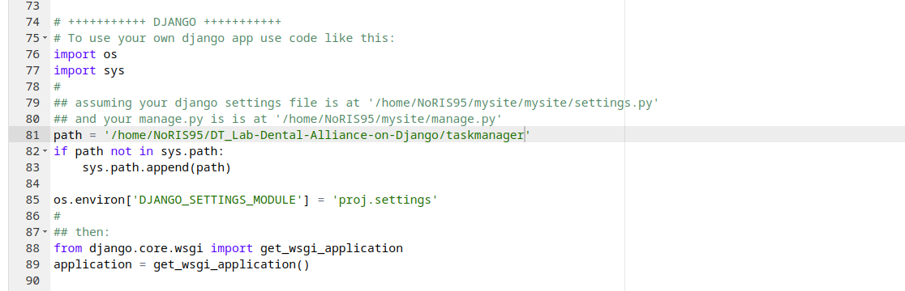 
  13. Возращаемся к терминалу Bash.
  ```
  cd proj
  vim settings.py
  ```
  14. В 30 строчке этого файла указываем ссылку на наш сайт. В 122 и 125 строчках указываем названия директорий, в которых будут храниться статические файлы (в нашем случае названия этих директорий static и media);в 123 и 126 строчках указываем пути к этим директориям; в 127 строчке указываем путь к директории, в которой будут находится html-шаблоны.После этого сохраняем файл `settings.py` и выходим из режима редактирования.
  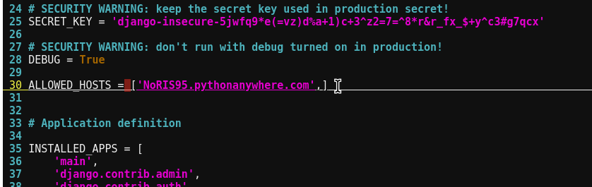
  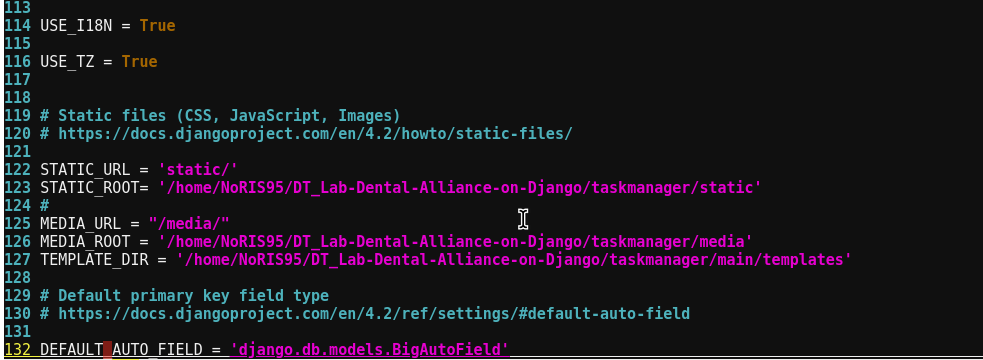
  15. Заходим в директорию, где лежит файл `manage.py` и применяем миграции.
  ```
  cd ..
  python manage.py makemigrations main
  python manage.py migrate
  python manage.py collectstatic
  ```
  13. Создаем суперпользователя.
  ```
  python manage.py createsuperuser
  ```
  14. Заходим на сайт pythonAnywhere и перезагружаем хостинг.
  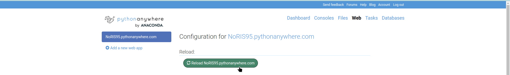
